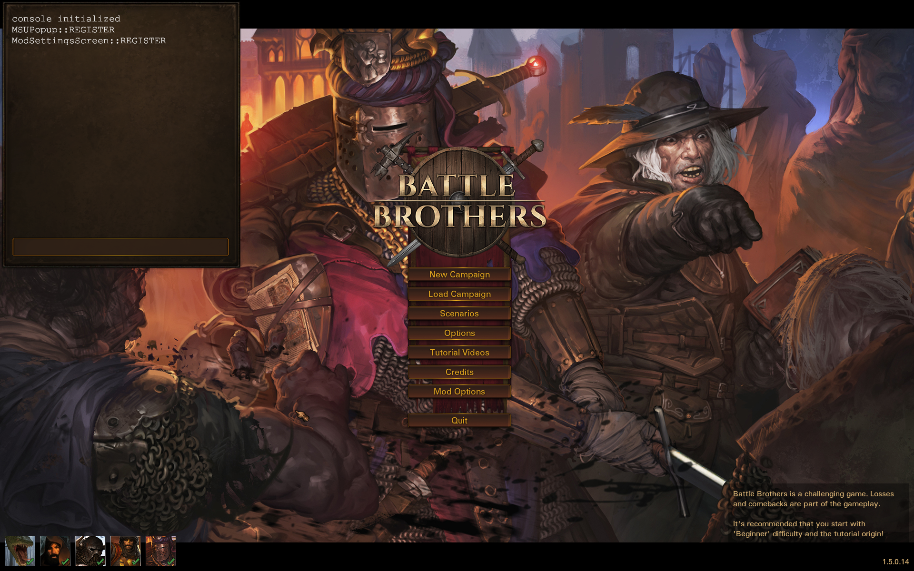

# **Battle Brothers Console**
This repos contain a mod for Battle Brothers enabling a console to help debuging the interfaces.



## **Why this mod ?**
A [Dev Console](https://www.nexusmods.com/battlebrothers/mods/380?tab=posts) mod already exist but do not respond to my need which is having an equivalant to the google chrome console (more or less). This is why I've done this mod as I can't find a Github repository for [Dev Console](https://www.nexusmods.com/battlebrothers/mods/380?tab=posts) where I can provide a pull request. The solution to my need are listed below in functionality part.

## **Functionality**
- Pressing Tab to toggle console visibility at any moment (in menu or in game).
- When pressing enter, the Input in the console is executed with the [eval()](https://developer.mozilla.org/fr/docs/Web/JavaScript/Reference/Global_Objects/eval) JavaScript function. So you basicaly can't execute Squirrel code directly. You will have to create a connection between JavaScript and Squirrel before in your own mod.
- Pressing ALT toggle DOM debug which create a tooltips containing the HTML of the hovered element.
- Customize some keys related to console mod in Mod Options menu.
- Arrow up and down when the console input is focused to retreive previous commands.
- Arrow up and down when DOM debug is activated to move to the parent element. You can repeat the process until you reach the HTML body.
- In Squirrel add a global `::Console` which can be used like this `::Console.log("test")` to log to the console that you can see in the upper screenshot.
- In frontend, console function has been replaced to log in the console.

## **Optimisation**
- Create the smalest number of element in the DOM
- When removing the console from the screen using Tab, logs disapear and are not pushed in the DOM to avoid freeze when logging a lot

## **Dependencies**
- [Modding Standards and Utilities (MSU)](https://www.nexusmods.com/battlebrothers/mods/479)
- [Modding script hooks](https://www.nexusmods.com/battlebrothers/mods/42)

## **FAQ**
### **How to execute Squirrel code from JavaScript ?**

The game is devided in 2 languages, Javascript for the UI and Squirrel for the Logic. The Logic can update the UI, for example when a Brother take a hit we update the lifebar, aswell as the UI can update the Logic, for example when you change the equipement of a Brother we update his defensive stats. So we have two bridge :
- Javascript -> Squirrel
- Squirrel -> Javascript

Here an example which use both bridge

```js
var MyMod = function () {
    //This variable will contain ur bridge JavaScript -> Squirrel.
	this.mSQHandle = null
	this.mID = "MyMod";
}

MyMod.prototype.onConnection = function (_handle) {
	this.create($('.root-screen'));
	//I get my bridge and store it JS -> SQ
	this.mSQHandle = _handle;

}

/**
 * Send Ping to SQ code (backend)
 */
MyMod.prototype.sendPing = function (data) {
    SQ.call(this.mSQHandle, 'recievePing', data, function(){
		console.log("ACK : ping has been received by the backend")
	});
}

/**
 * Method to recieve a pong from the backend
 */
MyMod.prototype.recievePong = function (_handle) {
	console.log("I've received a Pong from backend")
}

...

//Will register Console class with as ID: "Console". This ID will be used SQuirrel side to create a bridge SQuirrel -> JavaScript
registerScreen("MyMod", new Console());
```

```js
this.myMod <- {
	ID = "mod_myMod",
	Version = "1.0.0",
	Name = "MyMod",

	m = {
        //This variable will contain ur bridge SQuirrel -> JavaScript
		JSHandle = null,
	}

	function connect()
	{
        //We connect ur JavaScript class MyMod which have the id "MyMod" and put it in JSHandle
		this.m.JSHandle = ::UI.connect("MyMod", this);
	}

	function sendPong()
	{
		this.m.JSHandle.asyncCall("recievePong",null);
		::Console.log("pong has been send to the frontend but we don't know when he will receive it")
	}

	function recievePing()
	{
		::Console.log("I've received a Ping from backend")
	}
};
```